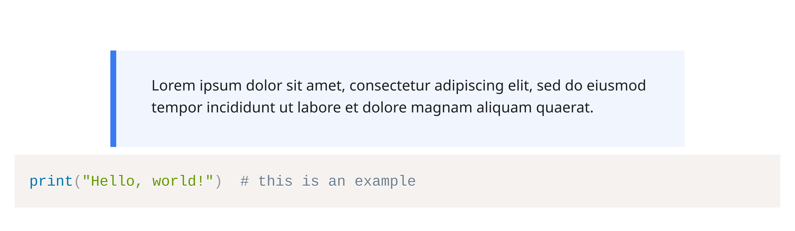

# Moodular

Use Typst's HTML export to generate content for your Moodle courses, but preview them faithfully in Tinymist or the webapp.

This package is somewhat opinionated, as it contains features tailored towards specific Moodle plugins used at our own school:

- [Components for Learning (C4L)](https://componentsforlearning.org/) ([Atto](https://moodle.org/plugins/atto_c4l)/[TinyMCE](https://moodle.org/plugins/tiny_c4l) plugin): Moodular recreates the HTML structure of C4L blocks, and also renders them for PDF export. Most but not all components are currently supported; please [open an issue](https://github.com/SillyFreak/typst-moodular/issues) if you need a specific one.

## Getting Started

To add this package to your project, use this:

````typ
#import "@preview/moodular:0.1.0" as moodular: c4l

#show: moodular.preview()  // if you only want HTML export, and use "regular" mode only to preview
// or
#show: moodular.export()   // if you want HTML and PDF export for your document

// start writing

#c4l.key-concept[#lorem(20)]

```py
print("Hello, world!")  # this is an example
```
````

In preview, that example looks like this:


Exporting to HTML (and for now manually extracting the `<body>` tag) gives you this (line breaks inserted for preview purposes):

```html
<p class="c4l-spacer"></p>
<div class="c4lv-keyconcept" aria-label="Key concept">Lorem ipsum dolor sit amet,
consectetur adipiscing elit, sed do eiusmod tempor incididunt ut labore et dolore
magnam aliquam quaerat.</div>
<pre class="language-py"><code>print("Hello, world!")  # this is an example</code></pre>
```

... which is almost identical to what you get when entering the same in Moodle using the TinyMCE editor with the C4L plugin, and looks like this:



(Note that the spacing is not perfect and [can be improved](./thumbnail-moodle-no-spacer.png) by removing the `<p class="c4l-spacer"></p>` element, but since that is inconsistent with the C4L plugin's output, I chose to keep it as is for now. Have a look at [this issue](https://github.com/reskit/moodle-tiny_c4l/issues/20) to track progress on this.)

## Usage

See the [manual](docs/manual.pdf) for details.

## License

Copyright (C) 2025 Clemens Koza

This program is free software: you can redistribute it and/or modify
it under the terms of the GNU General Public License as published by
the Free Software Foundation, either version 3 of the License, or
(at your option) any later version.

This program is distributed in the hope that it will be useful,
but WITHOUT ANY WARRANTY; without even the implied warranty of
MERCHANTABILITY or FITNESS FOR A PARTICULAR PURPOSE.  See the
GNU General Public License for more details.

You should have received a copy of the GNU General Public License
along with this program.  If not, see <https://www.gnu.org/licenses/>.
